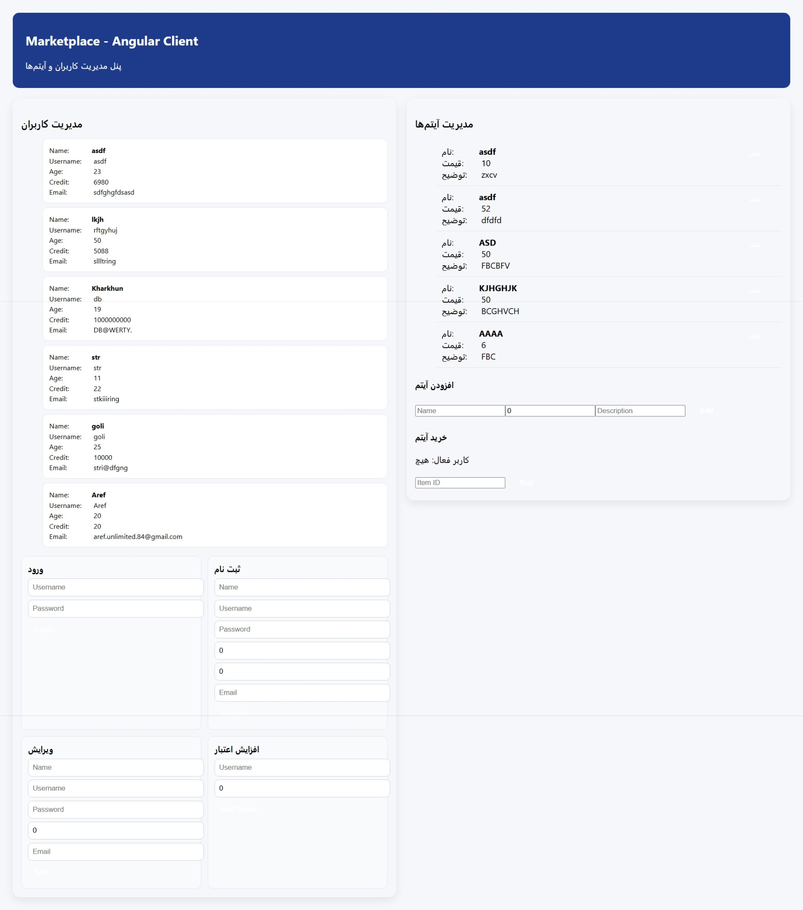

# 🛍 Marketplace Sample – Angular Frontend

## 📌 Project Description

This project is a **frontend implementation of a Marketplace system** developed using Angular.

It was created as a sample client-side application to simulate an e-commerce platform interface and to practice modern frontend development concepts such as component-based architecture and service communication.

The project is designed to work alongside a backend marketplace API.

---

## ✨ Features

- Product listing interface  
- Category-based product display  
- Product details view  
- Shopping cart UI  
- Responsive layout design  
- Component-based architecture  

---

## 🛠 Technologies Used

- Angular 17  
- TypeScript  
- HTML5  
- CSS3  
- Angular CLI  

---

## 🏗 Architecture & Structure

The project follows Angular’s modular structure:

- **Components** → UI sections  
- **Services** → API communication  
- **Modules** → Feature grouping  
- **Routing** → Page navigation  

---

## 📂 Project Structure

MarketplaceSample/
│
├── src/
│ ├── app/
│ │ ├── components/
│ │ ├── services/
│ │ ├── models/
│ │ └── pages/
│ │
│ ├── assets/
│ └── environments/

---

## ▶️ How to Run

1️⃣ Clone the repository

git clone https://github.com/GOLDER84/MarketplaceSample.git

2️⃣ Install dependencies

npm install

3️⃣ Run development server

ng serve

4️⃣ Open in browser

http://localhost:4200/

---

## 🧪 Development Server

The app automatically reloads when you change source files.

---

## 📸 Screenshots

---

## 🎯 Learning Objectives

- Practice Angular component architecture  
- Understand frontend-backend communication  
- Build scalable UI structure  
- Work with TypeScript in real projects  

---

## 👤 Author

**Aref Zargar**  
Computer Engineering Student

- GitHub: https://github.com/GOLDER84  
- LinkedIn: https://www.linkedin.com/in/aref-zargar-a95287367/  
- Email: aref.unlimited.84@gmail.com

